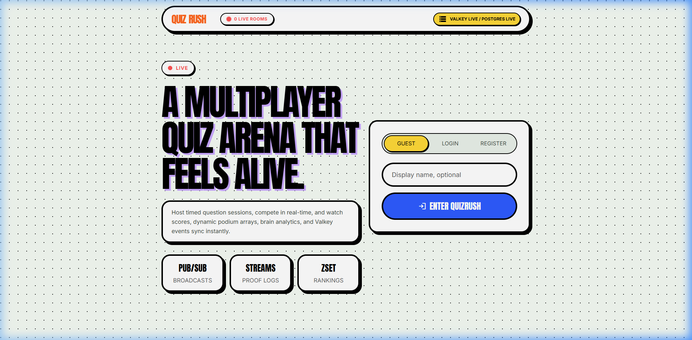
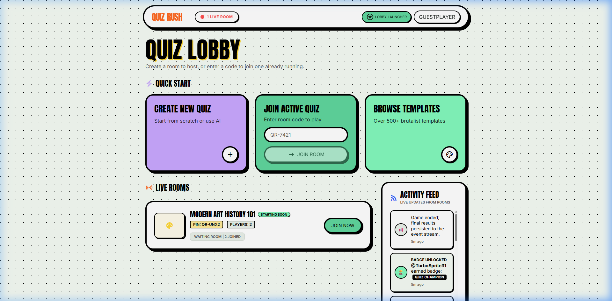
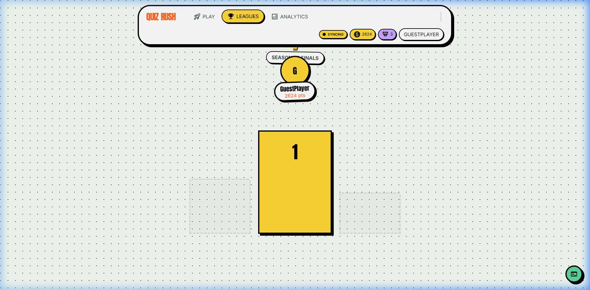

# QuizRush ⚡️

QuizRush is a blazing-fast, real-time multiplayer quiz arena powered by **Valkey** (Redis fork) and **Next.js**. It features sub-millisecond game state synchronization, dual-tier resilience, and a brutalist, mobile-first design.



---

## 🏗️ Architecture & Multi-Tier Resilience

QuizRush is built to survive. We use a **Valkey-Primary, Postgres-Secondary** architecture.

- **Valkey** handles all hot paths: room state, leaderboards, real-time player presence, and question tracking. If Valkey is up, the game is playable.
- **Postgres** handles persistent records: user accounts, historical data, and guest sessions. 
- **Resilience**: If Postgres goes down mid-game, QuizRush automatically degrades to `Fallback` mode. Live games continue uninterrupted, and guest players can still join and play exclusively via Valkey.

> **Note:** Check the live connection status in the lobby! The status pill indicates whether we're running fully connected or in fallback mode.

## 🚀 Features

- **Real-time Multiplayer:** Sub-millisecond sync powered by Valkey Pub/Sub and Streams.
- **Guest Play:** Jump straight into a room with zero sign-up friction.
- **Host Dashboard:** Full control over game flow, revealing answers, and advancing rounds.
- **Dockerized E2E Tests:** Comprehensive Playwright test suite that actively kills the Postgres container mid-test to verify resilience!

## 📸 Screenshots

| Host Dashboard | Player Leaderboard |
| -------------- | ------------------ |
|  |  |

## 🛠️ Quickstart

### Prerequisites
- Node.js 20+
- Docker & Docker Compose

### 1. Environment Setup

Copy the example environment file:
```bash
cp .env.example .env
```
*(Ensure `DATABASE_URL` and `VALKEY_URL` point to your local instances. See `.env.example` for details).*

### 2. Run Locally

Start the Valkey and Postgres dependencies (or run via the test compose file):
```bash
docker-compose -f docker-compose.test.yml up -d postgres valkey
```

Install dependencies and start the dev server + WebSocket engine:
```bash
npm install
npm run dev:all
```

### 3. Run E2E Tests

We include a rugged test suite that literally shuts down the database mid-run to prove our resilience architecture works.

```bash
docker-compose -f docker-compose.test.yml up --build --abort-on-container-exit
```

---
*Built with Valkey, Next.js, and raw adrenaline.*
